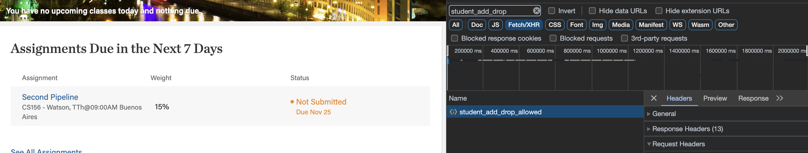

# HC-QUERY

## How to run the script (detailed version below). 
1. Clone this repo. 
1. Open developer tools in Forum, find any request to Forum API and copy your cookies. 
1. Edit `script.sh`, paste your cookies where indicated, and run it. 
1. Upload `results/results-without-grades.json`[here](https://forms.gle/WpqygtFy8QxVWau6A). 

## How to run the script stepy-by-step
1. [Click here](https://github.com/thomaslinck/hc-query/archive/refs/heads/main.zip), download this folder and unzip it. 
    1. Save it somewhere you will remember, you will need to navigate there shortly. 
1. Open Forum 
    1. Right click the page, click inspect 
    1. Go to Networks and filter by `student_add_drop` in the top: 
    
    1. If nothing shows up, refresh the page. 
        1. Click the `student_add_drop` request and click in Headers
        1. Copy all the text from the Cookie field
1. Open the `script.sh` file (from the folder you downloaded before) with Visual Studio Code. 
    1. Paste your Forum Cookies on the top of the file (where indicated), wrapped with double-quotes. 
    1. Save it. 
1. Run the script.sh 
    1. You can do so from VSCode by using `cmd + shift + p` then searching for Run Active File in Active  Terminal. 
1. When the program finishes running, there will be a file called `results-without-scores.json` inside a folder named `results`. 
    1. Upload your `results-without-scores.json` file [here](https://forms.gle/WpqygtFy8QxVWau6A). 
1. You are done, thank you so much :) 